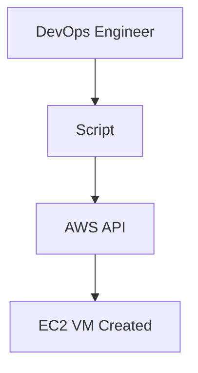

## VM (Virtual Machine)

these are based on cloud -> Azure, AWS, Google Cloud


DevOps aims to increase **productivity** and **efficiency** by automating repetitive tasks such as virtual machine (VM) creation and management using **AWS APIs**, **scripts**, and **authentication mechanisms**.


# 🛠️ DevOps: Automating AWS VM Creation

##  Overview
DevOps focuses on enhancing **productivity** and **efficiency** by automating infrastructure tasks. One common task is creating and managing **VMs (Virtual Machines)** using **AWS APIs**, **scripts**, and proper **authentication**.

---

##  Workflow

1. **Manual Process:**
   - User logs into AWS Console
   - Manually creates VM (e.g., EC2 instance)

2. **Automated Process via DevOps:**
   - Use scripts to log in and create VM automatically
   - Scripts interact with **AWS API**
   - Automation reduces time and human error

---

## ⚙️ Automation Pipeline



---

##  Authentication Flow

- Validate user/token using secure Auth
- Authenticated session grants script access to AWS
- Scripts handle login and VM creation automatically

---

##  Summary

DevOps automation in AWS helps:
- Reduce manual work
- Ensure secure VM provisioning
- Save operational time
- Increase deployment speed using **scripts + API + authentication**


AWS have -> AWS CLI (Command Line Interface)
         -> AWS CFT (CloudFormation Template)
Terraform -> Open Source (Automate AWS)
AWS CDK -> Specific 
but these days Companies are using the hybrid cloud services

==CLI (Command Line Interface) -> to manage the AWS Services==

Google Cloud -> KN8
AL/ML -> GCP
Virtual Machine -> AWS
Authorization -> Azure 


# <code style="color:blue">AWS</code>
 Library -> boto3
 
 ```python

import boto3

def create_ec2_instance():
    ec2=boto3.resource('ec2',region_name='')

    #launch
    instances=ec2.create_ec2_instance(
        ImageId=''
        MinCount=1
        MaxCount=1
        InstanceType=''
        KeyName=''
        SecurityGroupIds=[]
        SubNetId=[]
        TagSpecifications=[
            {
                resourceType:'instance',
                'Tags':[
                    {'Key':,'Value:'}
                ]
            }
        ]
    )
    print('Created Instance')
if __name__=='__main'
    create_ec2_instance()
```

```python
    
import boto3

def create_ec2_instance():
    ec2 = boto3.resource('ec2', region_name='us-east-1')  # Replace with your desired region

    # Launch EC2 instance
    instances = ec2.create_instances(
        ImageId='ami-0abcdef1234567890',  # Replace with a valid AMI ID
        MinCount=1,
        MaxCount=1,
        InstanceType='t2.micro',          # Replace with the desired instance type
        KeyName='your-key-pair',          # Replace with your key pair name
        SecurityGroupIds=['sg-0123456789abcdef0'],  # Replace with your security group ID(s)
        SubnetId='subnet-0123456789abcdef0',        # Replace with your subnet ID
        TagSpecifications=[
            {
                'ResourceType': 'instance',
                'Tags': [
                    {'Key': 'Name', 'Value': 'MyEC2Instance'}
                ]
            }
        ]
    )

    print('Created Instance:', instances[0].id)

if __name__ == '__main__':
    create_ec2_instance()>)
```

### <code style="color:red">Documentation</code>

--> [A Sample Tutorial - Boto3 1.38.36 documentation](https://boto3.amazonaws.com/v1/documentation/api/latest/guide/sqs.html)

### ==SQS (Simple Queue Service)==

This thing allow you to queue and then process messages.

## <code style="color:cyan">Installation of AWS CLI</code>

Step - 1 -> https://awscli.amazonaws.com/AWSCLIV2-[version.number].msi
Here the [version.number] is from [raw.githubusercontent.com](https://raw.githubusercontent.com/aws/aws-cli/v2/CHANGELOG.rst)

Step - 2 -> ==cmd== -> `aws --version`

